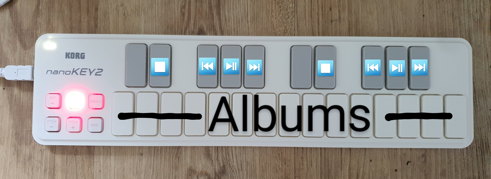

# Miconau (MIDI controlled audio player)

A basic audio player that is controlled via MIDI note-on events. Plays most common audio formats (mp3, flac, etc.).
On startup, the application will scan your audio library and assign every album to a white key on the keyboard.
You can control the audio with the black keys.

## Usage

```
cargo run
```
In this simple mode, the program will prompt you for configuration. Instead, you may also pass args to the start command:
```
cargo run library=[PATH_TO_LIBRARY] midi_device_index=[MIDI_INPUT_DEVICE_INDEX] output_device=[AUDIO_OUTPUT_DEVICE_NAME]
```
Example: 
```
cargo run library=/mnt/usb1/Music midi_device_index=1 output_device=plughw:CARD=Audio,DEV=0
```

## List available audio devices

```
cargo run list-devices
```

## Key bindings



- All white keys starting from middle C: play album 1-n
- D#: Stop
- F#: Previous track in album
- G#: Play/pause
- A#: Next track in album


