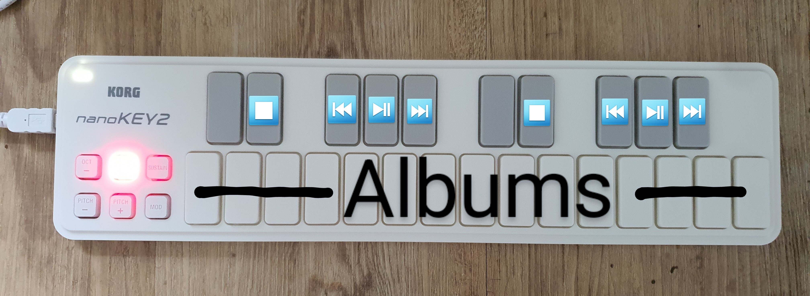

# Miconau (MIDI controlled audio player)

A audio player that is controlled via MIDI note-on events.
On startup, the application will scan your audio library and assign every album to a white key on the keyboard.
You can control the audio with the black keys. Uses mpv under the hood which can play a lot of audio file and stream formats.

## Usage
Make sure mpv is installed and in PATH. Windows is not supported.
Make sure, `error.wav` is in the same folder as the executable `miconau`.

```
cargo run --bin miconau -- --library-folder [PATH_TO_LIBRARY] --streams-folder [PATH_TO_STREAMS] --midi-device-index [MIDI_INPUT_DEVICE_INDEX] --start-octave [START_OCTAVE] --output-device [AUDIO_OUTPUT_DEVICE] --mpv-socket [MPV_SOCKET_PATH]
```
Example: 
```
cargo run --bin miconau -- --library-folder /mnt/usb1/Music --streams-folder ~/.config/miconau --midi-device-index 1 --start-octave 4 --output-device alsa/plughw:CARD=Audio,DEV=0
```

## Streams

Streams are configured separately from the music library. Point
`--streams-folder` at a folder containing a `streams.txt`, and the streams in it
are assigned to the lowest white keys, below the albums. The argument is
optional: without it, the white keys start at the first album.

`streams.txt` holds one block per stream, separated by blank lines. A block is
the name, the URL, and optionally the file name of a logo:

```
Radio Example
http://example.com/stream.mp3
example.svg

Another Station
http://example.org/live
```

Logos are SVGs in a `logos/` folder next to `streams.txt`, and are shown in the
web UI:

```
~/.config/miconau/
  streams.txt
  logos/
    example.svg
```

## List available audio devices

Use mpv to list available audio devices:

```
mpv --audio-device=help
```

## Key bindings



- All white keys starting from note C in `start-octave`: play stream 1-n or playlist 1-n
- D#: Stop
- F#: Previous track in playlist
- G#: Play/pause
- A#: Next track in playlist


